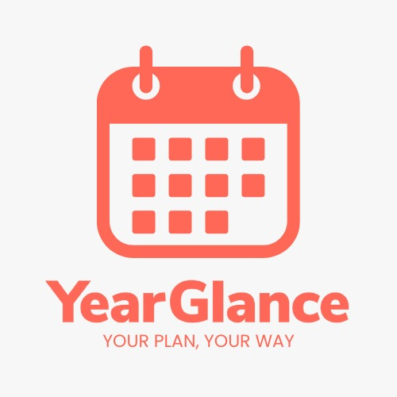

<h1 align="center">Hi, I'm Jericho 👋</h1>

  <b>Full Stack & Automations Engineer</b> 
  3 years building web & mobile apps · AI workflows · CI/CD · from Manila 🇵🇭

  Reduced manual workloads by up to <b>70%</b> through custom automation, AI-driven workflows, and cloud infrastructure.

---

### 🛠️ Tech Stack

**📱 Mobile**

**🎨 Frontend**

**🛠️ Backend**

**🤖 AI & Automation**

**☁️ DevOps & Cloud**

**⚙️ Tools**

---

### 💼 Professional Experience

**Full Stack & Automations Engineer** · *GOOSELAW Immigration Law Firm* · Sept 2025 – Jan 2026
- Engineered an **n8n-driven document automation system** with OpenAI + Gemini that reduced legal document prep time by **70%** (Visa, LMIA, H&C letters)
- Established the firm's first version control + CI/CD pipeline (GitHub Actions → GCP Cloud Run), replacing direct production edits
- Built a Next.js + Firebase client questionnaire app with real-time validation and secure evidence uploads

**Full Stack Developer** · *Seafair Cruises / Expoships LLLP* · June 2025 – Sept 2025
- Shipped features and performance fixes on a monolithic platform (PostgreSQL + Supabase)
- Proposed workflow improvements that reduced build times and streamlined deployments

**Full Stack Engineer** · *JLabs Innovatech Inc.* · Jan 2024 – June 2025
- Delivered features across **7 client products** using React, React Native, NestJS, and Laravel:
  -  **[Pieza](https://pieza.ph)** — vehicle parts marketplace · web + mobile · built Excel import/export for product catalogs &nbsp;[iOS](https://apps.apple.com/ph/app/pieza/id6445899855) · [Android](https://play.google.com/store/apps/details?id=com.pieza)
  -  **[Reforal](https://reforal.com)** — dental clinic & lab referral portal · built the dentist community board and admin-portal mobile responsiveness
  -  **[Vublox](https://vublox.com)** — sports timeline platform · built the events timeline, under-18 content moderation, and invite management
  -  **[Year Glance](https://yearglance.com)** — multi-calendar year planner · added UI-toggling and event-filtering features
  - **Resqyou** — online traffic-violation ticketing handled by lawyers · built name/signature editing and PDF export
  - **Tulu** — car rental marketplace · built the favorites system and shipped UI/code optimizations
  - **WSG Energy Services** — built from scratch; PDF canvas with annotation tags

**Junior Full Stack Developer** · *Baytech BPO Corp.* · Jan 2023 – Jan 2024
- **PDFRun** (Vue + CodeIgniter) — PDF wizard sites with admin field insertion, payment modals, and feature-flag system for marketing
- **AvatarMaker** & **ChatPDF** (React + Laravel + Python + Docker) — AI generation tools with 5-trial monetization gates
- **SignedTrue** (Angular) — UI enhancements for PDF canvas

**Junior Full Stack Developer** · *Supafaya PTE LTD* · Oct 2022 – Jan 2023
- Led the **CRA → Vite migration** that fixed long build times and developer-experience pain
- Built sales and logistics features in React + Firebase

---

### 🎓 Research & Publication

🗑️ **KALAT (Keep Area Lean And Tidy)** — Capstone, BS Computer Engineering · Mapúa MCL 2024
A web-based system + Arduino hardware for data-driven solid waste management in Calamba City. GSM-equipped smart bins with real-time weight sensing feed a Next.js dashboard; routing optimized via Google OR-Tools VRP solver. Co-authored with J. David and J.P. Parica.
→ **[trash-backend](https://github.com/aslaii/trash-backend)** (Python/Flask + OR-Tools)

---

### 🚀 Personal Projects

- 📡 **[omni-channel](https://github.com/aslaii/omni-channel)** — Omnichannel comms webapp · email, SMS, voice, realtime chat (Firebase + Twilio)
- 🌐 **[bro-ser](https://github.com/aslaii/bro-ser)** — Minimal mobile browser built with Expo + shadcn/ui
- 🛍️ **[kulay-shop](https://github.com/aslaii/kulay-shop)** — React Native shopping app
- 💼 **[job-explore-api](https://github.com/aslaii/job-explore-api)** + **[mobile](https://github.com/aslaii/job-explore-mobile-firebase)** — Full-stack job board (TS API + Flutter app)
- ⚙️ **[dotfiles](https://github.com/aslaii/dotfiles)** — One-command macOS dev environment
- 💤 **[lazyvim](https://github.com/aslaii/lazyvim)** — My Neovim config

---

### 📜 Certifications

- **Cisco Certified Network Associate (CCNA)** — Routing & Switching · Cisco Networking Academy, 2020
- **Full Stack Open** — University of Helsinki, 2022

---

### 📫 Connect

